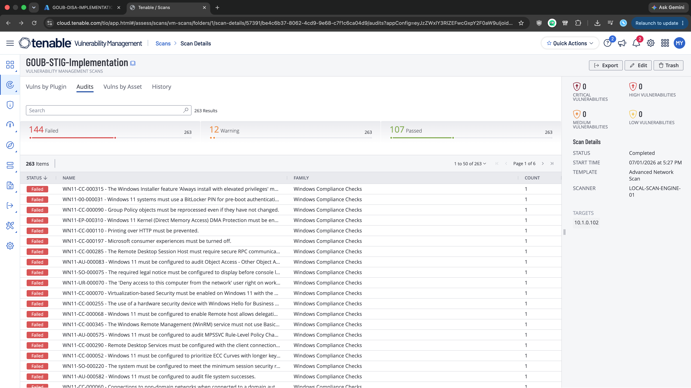
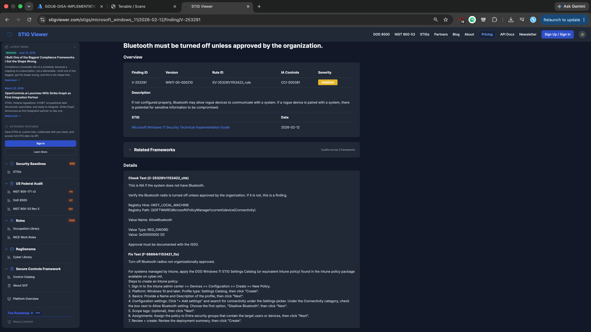
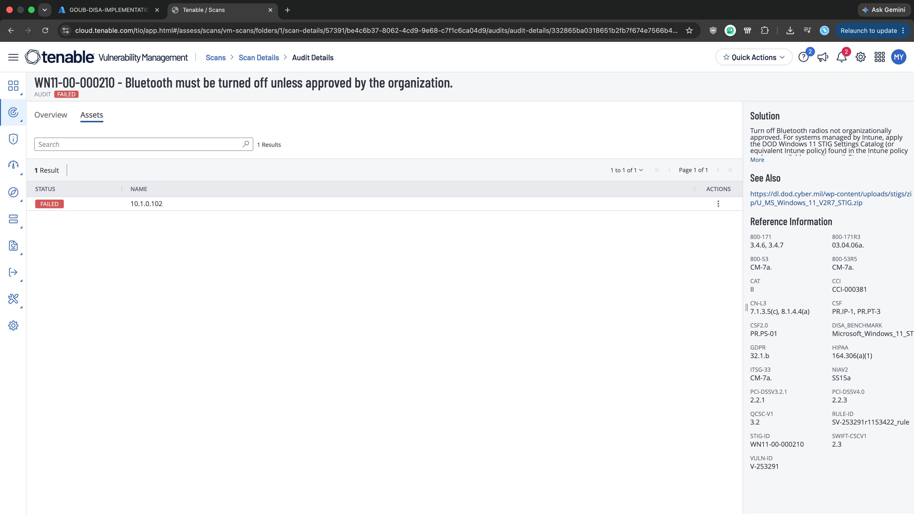
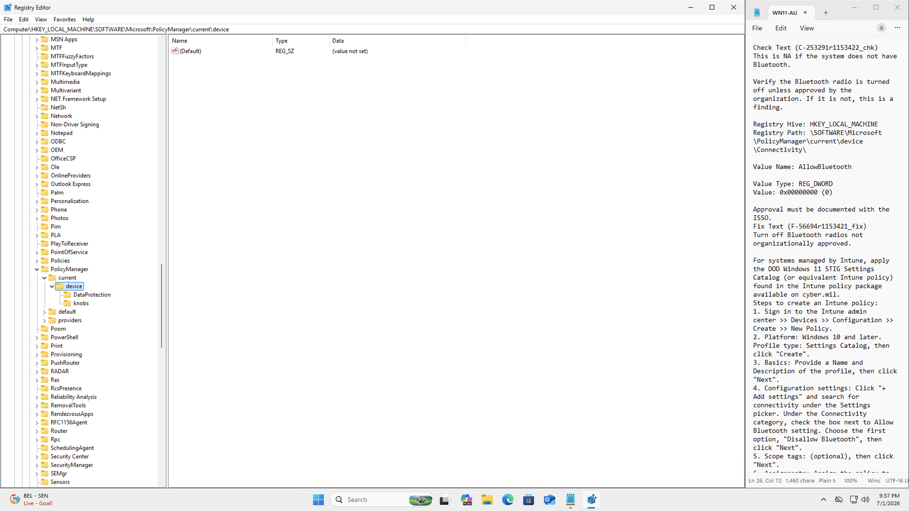
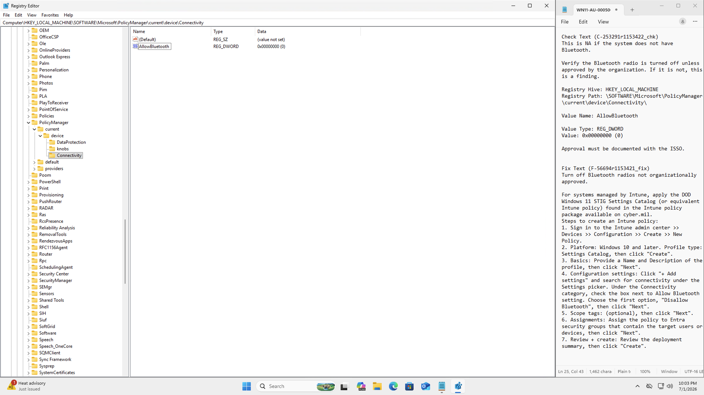
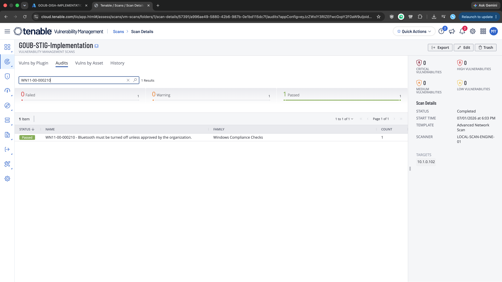
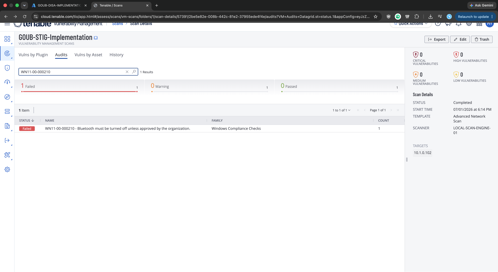
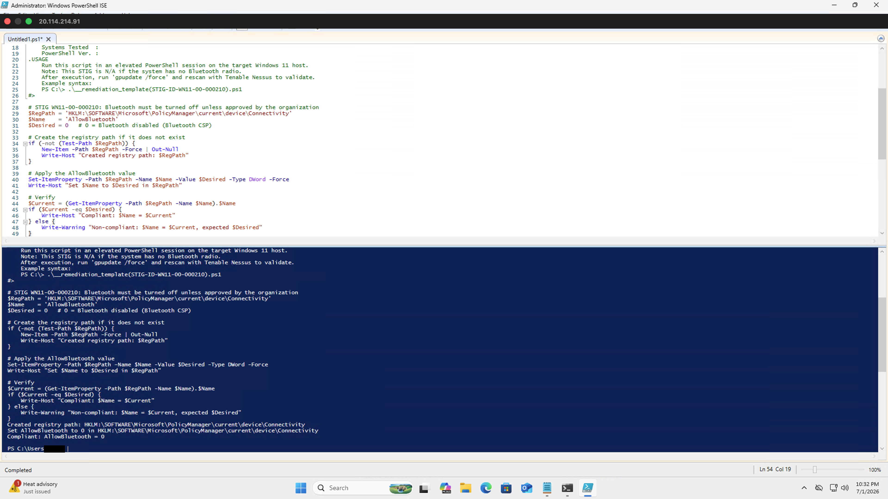

# Windows 11 STIG 08: V-253291 (WN11-00-000210)

**Status:** Published
**STIG:** DISA Microsoft Windows 11 Security Technical Implementation Guide v2r7
**Finding:** V-253291 (WN11-00-000210)

Part of the [DISA STIG Implementation with PowerShell](https://github.com/goubx/DISA-STIG-Implementation-w-PowerShell-series-) series.

---

## Overview

This entry hardens a stock Azure Windows 11 VM against one finding from the DISA Microsoft Windows 11 STIG v2r7 using PowerShell. The workflow:

1. Scan an unhardened Azure VM with Tenable's DISA STIG compliance audit.
2. Pick a failed finding from the Audit tab.
3. Remediate it manually to confirm the fix path.
4. Translate that fix into an idempotent PowerShell function.
5. Rescan to confirm the finding moves to passed.

Registry-based finding under `HKLM:\SOFTWARE\Microsoft\PolicyManager\current\device\Connectivity`. This one is worth flagging up front: DISA's Fix Text points at Intune ("apply the DOD Windows 11 STIG Settings Catalog"), not at Local Group Policy, because the setting lives under the Windows CSP (Configuration Service Provider) tree rather than under `\Policies\`. The Azure lab VM is not enrolled in Intune, so the manual remediation for this one is a direct registry write to the same CSP location Intune would have targeted. The PowerShell script then automates that same registry write.

---

## Target Platform

| Field            | Value                          |
|------------------|--------------------------------|
| OS               | Windows 11 Pro                 |
| Azure VM         | Standard                       |
| Private IP       | 10.1.0.102                     |
| Domain joined    | No                             |
| Intune enrolled  | No                             |

---

## Tools Used

| Tool                          | Purpose                                       |
|-------------------------------|-----------------------------------------------|
| Tenable Nessus                | Scanning with the DISA STIG audit             |
| Windows PowerShell ISE        | Remediation engine                            |
| Registry Editor               | Manual remediation + state verification       |
| STIG Viewer                   | Finding reference (Check + Fix text)          |
| Azure                         | Lab VM hosting                                |

Note: no `gpedit.msc` for this one. There is no Group Policy setting that maps to this finding; the STIG's manual fix is the Intune Settings Catalog, which the lab VM cannot use.

---

## Lab Setup

The lab uses a stock Azure Windows 11 VM with Windows Defender Firewall disabled so the Tenable scanner can reach the host across the lab network:


> Note: this is a lab-only step. In production you would scope firewall rules to permit the scan engine rather than disabling the firewall outright.

---

## Scan Configuration

The Tenable scan that produced this finding uses the Advanced Network Scan template, configured once and reused across all findings in this series:

1. **Scans, Create Scan, Advanced Network Scan**
2. Name: `GOUB-STIG-IMPLEMENTATION`
3. Target: the VM's private IP (`10.1.0.102`)
4. Scanner: internal scan engine
5. Credentials: local administrator on the VM

### Compliance audit

Under the Compliance tab, the DISA Microsoft Windows 11 STIG v2r7 audit is added:


### Plugin scoping

To keep the scan fast and focused on STIG findings only, every plugin family is disabled except one:

1. Plugins, filter for `policy`, enable **Policy Compliance**.
2. Inside Policy Compliance, enable only **Windows Compliance Checks** (Plugin ID 21156).


---

## Initial Scan

The scan against the Azure VM returned 144 failed audits out of 263 total checks (12 warnings, 107 passed). STIG findings on a default Windows 11 image are dense, which makes this a good source of remediation work:



The finding this repo documents:

> **WN11-00-000210** : Bluetooth must be turned off unless approved by the organization.

Bluetooth is a wireless attack surface. Enterprise builds should ship with it disabled by default so that unapproved peripherals and adjacent hosts cannot pair with corporate assets without an explicit exception being granted and documented.

---

## Finding Details

Pulled from the STIG Viewer entry and cross-checked against the Tenable audit detail:

| Field            | Value                          |
|------------------|--------------------------------|
| STIG ID          | WN11-00-000210                 |
| Vulnerability ID | V-253291                       |
| Severity         | Medium (CAT II)                |
| CCI              | CCI-000381                     |
| Rule ID          | SV-253291r1153422_rule         |





**Why it matters:** Bluetooth is a short-range wireless attack surface that ships enabled on most consumer builds. An adjacent attacker can attempt pairing attacks, exploit stack vulnerabilities (BlueBorne-class bugs and similar), or use approved peripherals like keyboards to inject input. On a device that has no organizational need for Bluetooth, the safest default is off; if a user needs it, that becomes a documented exception with the ISSO instead of a quiet capability every device carries.

**Fix per DISA (paraphrased):**
> Turn off Bluetooth radios not organizationally approved. For systems managed by Intune, apply the DOD Windows 11 STIG Settings Catalog and set the Allow Bluetooth setting to "Disallow Bluetooth".

Translated to the registry state that Intune would produce:

| Field         | Value                                                                            |
|---------------|----------------------------------------------------------------------------------|
| Hive          | HKEY_LOCAL_MACHINE                                                               |
| Path          | `\SOFTWARE\Microsoft\PolicyManager\current\device\Connectivity`                  |
| Value Name    | AllowBluetooth                                                                   |
| Value Type    | REG_DWORD                                                                        |
| Value Data    | 0x00000000 (0)                                                                   |

---

## Step 1: Manual Remediation

Before touching anything, I opened Registry Editor (`regedit.exe`) and navigated to `HKLM\SOFTWARE\Microsoft\PolicyManager\current\device`. The `Connectivity` subkey did not exist at all; only `DataProtection` and `knobs` were present:



Missing key = the check fails, which matches what Tenable reported.

This is where the workflow deviates from the earlier STIGs in the series. DISA's Fix Text for this rule does not offer a Local Group Policy path; the only supported manual fix is applying the DOD STIG Settings Catalog via Intune. The lab VM is not Intune-enrolled and cannot be for this exercise, so I created the `Connectivity` subkey and `AllowBluetooth` DWORD directly in Registry Editor at the CSP path Intune would have written to:



Direct-registry edits normally would not be my first choice, but for a CSP-only setting on an un-enrolled host there is no cleaner path, and the resulting registry state is the same one an Intune Settings Catalog policy would produce.

After rerunning the Tenable scan, the finding passes:



The manual fix works. Now to translate it into a script.

---

## Step 2: Capture the Registry Export

The correct registry state, after the manual fix, is:

```reg
Windows Registry Editor Version 5.00

[HKEY_LOCAL_MACHINE\SOFTWARE\Microsoft\PolicyManager\current\device\Connectivity]
"AllowBluetooth"=dword:00000000
```

That tells the script exactly what to produce: the `Connectivity` key under `Microsoft\PolicyManager\current\device`, a DWORD named `AllowBluetooth`, and the value `0x00000000`.

---

## Step 3: Revert and Re-verify

I deleted the `Connectivity` subkey to return the system to its baseline and reran the scan. The finding is failed again, as expected:



Now there's a clean baseline to validate the script against.

---

## Step 4: PowerShell Remediation

```powershell
function Set-StigRule-V253291 {
    <#
    .SYNOPSIS
        V-253291: Bluetooth must be turned off unless approved by the organization.

    .DESCRIPTION
        Severity:        CAT II (Medium)
        STIG ID:         WN11-00-000210
        CCI:             CCI-000381
        Tenable Plugin:  Windows Compliance Checks (21156)
        Reference:       DISA Microsoft Windows 11 STIG v2r7

        Disables the Bluetooth radio at the Windows CSP layer by writing
        AllowBluetooth = 0 under the Connectivity policy key. This is the
        same registry state an Intune "Allow Bluetooth = Disallow Bluetooth"
        Settings Catalog policy would produce. Use this for Windows 11
        endpoints that are NOT Intune-enrolled and where Bluetooth is not
        organizationally approved.

        This STIG is N/A if the device has no Bluetooth radio.

    .EXAMPLE
        Set-StigRule-V253291
    #>
    [CmdletBinding(SupportsShouldProcess)]
    param()

    $RegPath = 'HKLM:\SOFTWARE\Microsoft\PolicyManager\current\device\Connectivity'
    $Name    = 'AllowBluetooth'
    $Desired = 0   # 0 = Bluetooth disabled (Bluetooth CSP)

    # Create the registry path if it does not exist
    if (-not (Test-Path $RegPath)) {
        New-Item -Path $RegPath -Force | Out-Null
        Write-Host "Created registry path: $RegPath"
    }

    # Apply the AllowBluetooth value
    Set-ItemProperty -Path $RegPath -Name $Name -Value $Desired -Type DWord -Force
    Write-Host "Set $Name to $Desired in $RegPath"

    # Verify
    $Current = (Get-ItemProperty -Path $RegPath -Name $Name).$Name
    if ($Current -eq $Desired) {
        Write-Host "Compliant: $Name = $Current"
    } else {
        Write-Warning "Non-compliant: $Name = $Current, expected $Desired"
    }
}
```

What it does, in order:

1. **Check path.** `Test-Path` confirms whether the `Connectivity` CSP key exists.
2. **Create if missing.** `New-Item -Force` creates the key and any missing parents.
3. **Set the value.** `Set-ItemProperty` writes `AllowBluetooth` as a DWord with the desired data (0).
4. **Verify.** Reads the value back and emits a Compliant or Non-compliant line.

Running it from an elevated PowerShell ISE session against the reverted baseline:



Output:

```
Created registry path: HKLM:\SOFTWARE\Microsoft\PolicyManager\current\device\Connectivity
Set AllowBluetooth to 0 in HKLM:\SOFTWARE\Microsoft\PolicyManager\current\device\Connectivity
Compliant: AllowBluetooth = 0
```

---

## Step 5: Final Validation

After rerunning the same Tenable scan, the finding passes:


---

## Result

| Stage                        | WN11-00-000210 |
|------------------------------|----------------|
| Initial scan                 | Failed         |
| After manual remediation     | Passed         |
| After reverting              | Failed         |
| After PowerShell remediation | Passed         |

The finding was cleared both by hand and programmatically, with the scan-pass state proven against a clean baseline both times.

---

## Notes

### Why this one is not a GPO fix
Most Windows 11 STIG findings in this series map to either a Local Group Policy setting or a direct Group Policy-managed registry value under `\SOFTWARE\Policies\`. This one does not. `AllowBluetooth` lives under `\SOFTWARE\Microsoft\PolicyManager\current\device\Connectivity`, which is the Windows CSP tree that Intune (and other MDMs like Workspace ONE and Kandji) write to via the DevicePolicyManager. There is no GPO ADMX template that hits this location, which is why DISA's Fix Text is Intune-only. On an un-enrolled host, direct registry writes to the CSP path are functionally equivalent to what an MDM would produce.

### Operational impact
Setting `AllowBluetooth = 0` disables the Bluetooth radio and stack for the device. Users lose the ability to pair or use any Bluetooth peripheral: wireless mice and keyboards, headsets, file transfer, Windows Nearby Share over BT, and Bluetooth-based tethering. On workstations with USB peripherals only this is a non-event; on laptops, tablets, and 2-in-1 devices this typically breaks the user's normal input path unless wired peripherals are already in place.

### Approval-based exception
DISA calls this out explicitly: Bluetooth may be enabled if organizationally approved, and the approval must be documented with the ISSO. The STIG check is not "Bluetooth must never run"; it is "Bluetooth must not run without a documented approval". For a fleet with mixed policy, the remediation belongs in a separate policy scope that excludes the approved users or devices, rather than applied universally.

---

## References

- [DISA STIG Library](https://public.cyber.mil/stigs/)
- [STIG Viewer entry for V-253291](https://www.stigviewer.com/stigs/microsoft_windows_11/2026-02-12/finding/V-253291)
- [Tenable Plugin Database](https://www.tenable.com/plugins/search)
- [Microsoft: Policy CSP - Connectivity](https://learn.microsoft.com/en-us/windows/client-management/mdm/policy-csp-connectivity)
